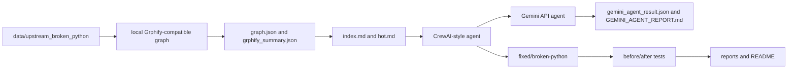

# PLAN - Architecture And Workflow

## Architecture

## Key Decisions

- Use a deterministic local graph runner so graph creation costs no LLM tokens.
- Preserve optional real CrewAI/LangGraph adapters without requiring network installs for normal grading.
- Keep `hot.md` and `grphify_summary.json` as the minimal context packet.
- Use file-by-file tests to prove both original failures and repaired behavior.

## Trade-Offs

The project does not require the external Grphify binary at runtime. Instead, it produces Grphify-compatible outputs using AST extraction and explicit evidence labels. This keeps the submission reproducible in a clean Python environment while matching the assignment's graph-first workflow.

## Gemini Evidence Persistence

The `gemini` CLI command writes the latest API execution to `artifacts/gemini_agent_result.json` and `reports/GEMINI_AGENT_REPORT.md`. This makes the AI-agent result auditable instead of only visible in terminal output.
